```{r setup, include=FALSE}
knitr::opts_chunk$set(echo = TRUE)
```

# Methods

## CRC atlas as the reference data

### Mapping cell-types between CRC atlas and ground-truth proportions

To test the different deconvolution methods on CRC bulk RNAseq data using the CRC atlas constructed as a reference, it was found the best overlap between the atlas cell-types and the cell phenotypes present in the ground-truth proportions of the bulk RNAseq data. All cell-types/phenotypes that did not have a match between the atlas and the ground-truth were simply grouped in the 'Other cells' cell-type.

The cell-types in the CRC atlas, as well as the ground-truth phenotypes, were grouped into 11 different cell-types (more details in the next table): cancer cells, stromal cells, anti-inflammatory macro/mono, pro-inflammatory macro/mono, B-cells, CD4+ T-cells, regulatory T-cells, CD8+ T-cells, proliferative T-cells, NK cells, other cells.

###  {.unnumbered style="overflow-y: scroll; height:600px;"}

+------------------------------+------------------------------+-----------------------------------+
| CRC Atlas cell-types         | Deconvolution cell-types     | Ground-truth phenotypes           |
+=============================:+:============================:+===================================+
| Tumour Epithelial cells      | Cancer cells                 | Apoptotic_tum                     |
|                              |                              |                                   |
|                              |                              | Bcat+\_tum                        |
|                              |                              |                                   |
|                              |                              | CD15+\_Bcat+\_tum                 |
|                              |                              |                                   |
|                              |                              | CD15+\_HLA-DR+\_Bcat+\_tum        |
|                              |                              |                                   |
|                              |                              | CD15+\_tum                        |
|                              |                              |                                   |
|                              |                              | HLA-DR+\_Bcat+\_tum               |
|                              |                              |                                   |
|                              |                              | IDO+\_Bcat+\_HLA-DR+\_tum         |
|                              |                              |                                   |
|                              |                              | P16ink4a+\_tum                    |
|                              |                              |                                   |
|                              |                              | Prol_apoptotic_tum                |
|                              |                              |                                   |
|                              |                              | Prol_Bcat+\_tum                   |
|                              |                              |                                   |
|                              |                              | Prol_CD15+\_Bcat+\_tum            |
|                              |                              |                                   |
|                              |                              | Prol_HLA-DR+\_Bcat+\_tum          |
|                              |                              |                                   |
|                              |                              | Prol_HLA-DR+\_TGFb+\_Bcat+\_tum   |
|                              |                              |                                   |
|                              |                              | Prol_HLA-DR+\_tum                 |
|                              |                              |                                   |
|                              |                              | Prol_IDO+\_Bcat+\_HLA-DR+\_tum    |
|                              |                              |                                   |
|                              |                              | Prol_TGFb+\_Bcat+\_tum            |
|                              |                              |                                   |
|                              |                              | Prol_TGFb+\_tum                   |
|                              |                              |                                   |
|                              |                              | Prol_tum                          |
|                              |                              |                                   |
|                              |                              | TGFb+\_Bcat+\_CD15+\_tum          |
|                              |                              |                                   |
|                              |                              | TGFb+\_Bcat+\_tum                 |
|                              |                              |                                   |
|                              |                              | TGFb+\_tum                        |
+------------------------------+------------------------------+-----------------------------------+
| Stromal cells                | Stromal cells                | CD39+\_vessels                    |
|                              |                              |                                   |
|                              |                              | D2-40+\_vessels                   |
|                              |                              |                                   |
|                              |                              | Prol_vessels                      |
|                              |                              |                                   |
|                              |                              | TGFb+\_vessels                    |
|                              |                              |                                   |
|                              |                              | Vessels                           |
|                              |                              |                                   |
|                              |                              | D2-40+\_fibroblasts               |
|                              |                              |                                   |
|                              |                              | CD39+\_D2-40+\_fibroblasts        |
|                              |                              |                                   |
|                              |                              | CD56+\_CD39+\_D2-40+\_fibroblasts |
|                              |                              |                                   |
|                              |                              | CD57+\_D2-40+\_fibroblasts        |
|                              |                              |                                   |
|                              |                              | TGFb+\_fibroblasts                |
|                              |                              |                                   |
|                              |                              | TGFb+\_D2-40+\_fibroblasts        |
|                              |                              |                                   |
|                              |                              | Firboblasts                       |
+------------------------------+------------------------------+-----------------------------------+
| Anti-Inflammatory macro/mono | Anti-Inflammatory macro/mono | TGFb+\_monocytes                  |
|                              |                              |                                   |
|                              |                              | HLA-DR+\_CD163+\_macrophages      |
+------------------------------+------------------------------+-----------------------------------+
| Pro-Inflammatory macro/mono  | Pro-Inflammatory macro/mono  | HLA-DR+\_monocytes                |
|                              |                              |                                   |
|                              |                              | HLA-DR+\_macrophages              |
+------------------------------+------------------------------+-----------------------------------+
| Naïve B-cells                | B-cells                      | Bcells                            |
|                              |                              |                                   |
| Memory B-cells               |                              |                                   |
|                              |                              |                                   |
| Proliferative B-cells        |                              |                                   |
+------------------------------+------------------------------+-----------------------------------+
| Naïve CD4+ T-cells           | CD4+ T-cells                 | CD39+\_CD8-\_Tcells               |
|                              |                              |                                   |
| IL22+ CD4+ T-cells           |                              | CD4+\_Tcells                      |
|                              |                              |                                   |
| IL17+ CD4+ T-cells           |                              | CD57+\_CD8-\_Tcells               |
|                              |                              |                                   |
| Memory CD4+ T-cells          |                              | Intra_CD8-\_Tcells                |
|                              |                              |                                   |
| Follicular CD4+ T-cells      |                              |                                   |
+------------------------------+------------------------------+-----------------------------------+
| Regulatory CD4+ T-cells      | Regulatory T-cells           | Regulatory_Tcells                 |
|                              |                              |                                   |
|                              |                              | ICOS+\_Regulatory_Tcells          |
+------------------------------+------------------------------+-----------------------------------+
| Naïve CD8+ T-cells           | CD8+ T-cells                 | CD8+\_Tcell                       |
|                              |                              |                                   |
| CXCL13+ CD8+ T-cells         |                              | CD57+\_CD8+\_Tcells               |
|                              |                              |                                   |
| Memory CD8+ T-cells          |                              | Intra_CD39+\_CD8+\_Tcells         |
|                              |                              |                                   |
| Cytotoxic CD8+ T-cells       |                              | Intra_CD8+\_Tcells                |
|                              |                              |                                   |
|                              |                              | Intra_GZMB+\_CD8+\_Tcell          |
+------------------------------+------------------------------+-----------------------------------+
| Proliferative CD4+ T-cells   | Proliferative T-cells        | Prol_Tcells                       |
|                              |                              |                                   |
| Proliferative CD8+ T-cells   |                              |                                   |
+------------------------------+------------------------------+-----------------------------------+
| NK cells                     | NK cells                     | NK_cells                          |
+------------------------------+------------------------------+-----------------------------------+
| Mast cells                   | Other cells                  | Apoptotic_cells                   |
|                              |                              |                                   |
| cDCs                         |                              | VISTA+\_monocytes                 |
|                              |                              |                                   |
| pDCs                         |                              | Monocytes                         |
|                              |                              |                                   |
| unknown myeloid cells        |                              | Macrophages_undefined             |
|                              |                              |                                   |
| IgG+ Plasma cells            |                              | CD11c+\_macrophages               |
|                              |                              |                                   |
| IgA+ Plasma cells            |                              | VISTA+\_CD31+\_CD38+\_cells       |
|                              |                              |                                   |
| Unconventional T-cells       |                              | TGFb+\_CD31+\_CD38+\_cells        |
|                              |                              |                                   |
| LTi cells                    |                              | CD31+\_CD38+\_cells               |
|                              |                              |                                   |
| Double-Negative T-cells      |                              | Granulocytes                      |
|                              |                              |                                   |
|                              |                              | TGFb+\_granulocytes               |
|                              |                              |                                   |
|                              |                              | CD45RO_undefined                  |
|                              |                              |                                   |
|                              |                              | CD7+\_CD3-\_cells                 |
|                              |                              |                                   |
|                              |                              | CD56+\_D2-40+\_cells              |
+------------------------------+------------------------------+-----------------------------------+

### Subset of original CRC atlas

For computational reasons, and because one of the methods tested (*CIBERSORTx*) has a file quota of 1000 MB for each of their website users, a subset of the original atlas was created and used for all methods, including the calculation of cell-type markers (necessary for some of the methods). Also, only the cells from tumour samples were kept, as we only used tumour bulk RNAseq samples for deconvolution.

A maximum of 1 000 cells per cell-type was kept, which reduced the number of cells to a total of 10 587: 904 for NK cells; 683 for proliferative T-cells; and 1 000 for each of the remaining cell-types. The percentage of cells per patient was maintained.

### Cell-type markers

For each of the 11 cell-types, the cells from that cell-type were compared to all others to search for positive gene markers of that cell-type. Seurat (R package, v.4.0.3) was used for this. To reduce the genes to test, only those with a log2 fold-change value, on average, greater than 0.8 between the cell-type's cells and all others were analysed. Also, genes had to be expressed in at least 30% of the cells in the cell-type. The Wilcoxon Rank Sum test was used. A gene was considered a marker if the respective p-value was smaller than 0.01. A total of 1169 genes were obtained.

## Methods evaluated

A total of 10 methods were compared. In this section, a summary of what these methods can do is given. Generally, the methods can be separated into two major groups: those that try to solve the deconvolution equation, and thus are non-negative matrix factorization (NMF) based algorithms, and those that are based on neural networks to predict the proportions (and thus do not necessarily use the deconvolution equation). Only two of the methods evaluated belong to the last group of methods: *DigitalDLSorter* and *Scaden*.

***AutoGeneS*** *(python package, v.1.0.4)* starts by selecting the most interesting genes to use in the deconvolution by simultaneously minimizing the correlation and maximizing the distance between cell-types. The signature matrix is generated with only those genes and the proportions are estimated by minimising the regression error E: $A.S.X + E = B$. Also, this method already accounts for the mRNA content bias, where differing cell size, and thus varying per cell RNA content, can affect the correct estimation of cell-types proportions (see section 2.4.). *AutoGeneS* uses the average number of mRNAs in each cell-type (S in equation (2)) to try to correct for this bias.

***BisqueRNA** (R package, v.1.0.5)* starts by generating the signature matrix by averaging read counts within each cell-type in the single-cell data. Together with the proportions of the cell-types in the single-cell data, the method then learns gene-specific transformations of the bulk data to account for technical biases between single-cell and bulk technologies. *BisqueRNA* then estimates the bulk RNAseq data proportions using the signature matrix and the transformed bulk data.

***BSeqSC** (R package, v.1.0)* generates a signature matrix that will be used to estimate the proportions of a bulk RNAseq dataset using *CIBERSORTx* method, explained below. When this method was first developed, and due to licensing requirements, the source code for estimating the proportions needed to be downloaded separately from *CIBERSORTx* website. However, it seems that new releases of *CIBERSORTx* no longer have the source code available. As such, we generated the signature matrix through this R package and then uploaded it to *CIBERSORTx* website to perform the estimation. Regarding the generation of the signature matrix from the scRNAseq data, the gene expression is averaged across all cells within each cell type. A list of genes known to be markers of the cell-types in question must be given so that the signature matrix is only calculated with those. Optionally, the single-cell counts can be re-scaled before computing the average gene expression. If so, the data is transformed into counts per million (CPM) and re-scaled using the cell-types' average counts.

***CIBERSORTx*** *(Website)* first sets to 0 counts the genes whose average expression in a log2 space is low, to then aggregate cells from the same cell-type by summing the counts in non-linear space from a few cells and transforms the summed counts into CPM counts. This aggregation process is repeated several times to generate several transcriptome replicates per cell-type. The genes used in the final signature matrix are those that are differentially expressed in at least one of the cell-types. This method gives the opportunity to optionally handle the technical variation between the signature matrix (single-cell RNAseq) and the bulk mixture (bulk RNAseq) while preserving biological signal. *CIBERSORTx* then estimates the bulk RNAseq data proportions using the signature matrix and the bulk data.

***DigitalDLSorter** (R package, v.0.1.1)* trains Deep Neural Network (DNN) models with bulk RNAseq samples simulated from scRNAseq aggregated and pre-characterised data and whose composition is thus known. The final trained model is then used to estimate the proportions of true bulk RNAseq samples. Furthermore, this method can simulate new single-cell profiles from real ones to increase signal and variability in small datasets or in those with under-represented cell-types.

***DWLS*** *(R script)* starts by calculating the cell-types' differentially expressed genes using *Seurat (R package, v.4.0.3)* under the bimod likelihood ratio test. After that, several candidate signature matrices with 50 to 200 marker genes, where the expression values of the genes are averaged across each cell-type, are tested. The best signature matrix corresponds to the candidate with the lowest condition number. The signature matrix is then used to estimate the cell-types' proportions of the bulk RNAseq data by solving the deconvolution equation through a weighted least squares approach.

***MOMF*** *(R package, v.0.2.0)* aggregates cells from the same cell-type by summing the raw counts. These cell-type profiles are normalised by dividing them by the multiplication of the corresponding cell-type's total counts with a weight factor (proportion of total cell-type counts in the total counts of the scRNAseq data). MOMF then estimates the bulk RNAseq data proportions using the signature matrix and the bulk data.

***MuSiC*** *(R package, v.0.2.0)* starts by choosing genes with low cross-subject variance, critical for transferring cell type-specific gene expression information from one dataset to another. Prediction of proportions for closely related cell-types is difficult, due to their gene expression close correlation. Because of this *MuSiC* optionally employs a tree-guided procedure that recursively zooms in on closely related cell types to estimate the proportions.

***Scaden*** *(python package, v.0.9.4)* uses a deep neural network ensemble trained on artificial bulk data simulated with a given scRNAseq reference to infer the cellular composition of the samples. The final trained model is then used to estimate the proportions of true bulk RNAseq samples.

***SCDC*** *(R package, v.0.0.0.9000)* is an ensemble method that combines the deconvolution results from different scRNAseq reference datasets. The references that better recapitulate the true underlying gene expression profiles of the bulk samples are given higher weights when integrating the different results together to produce a final estimation.

## RNA content bias correction

Cell-types have differing cell size, i.e., varying per cell RNA content. For example, a monocyte usually has more mRNA content than a T-cell. This can affect the correct estimation of the cellular proportions of the cell-types, as methods will most likely estimate the RNA proportions of the cell-types instead. This can be even more prominent when using scRNAseq data techniques, which may normalize cDNA libraries to the same concentration prior to sequencing.

Previous studies have tried to address this matter, by applying RNA content bias correction on the estimated proportions [@Zaitsev2019] or on the reference matrix, prior to the estimation of proportions [@sosina2020]. In both cases, this correction is applied using cell-type factors, which are values that represent the relative RNA content per cell for the cells in the mixture.

As such, each method was further tested with and without RNA content bias correction. Both ways of correcting RNA content bias were evaluated. RNA content bias correction was not tested on methods *AutoGeneS* and *MuSiC_woGrouping* (*MuSiC* version where the tree-guided procedure is not performed when estimating the proportions), as these methods were already implemented by taking into consideration the RNA content bias.

When applying the correction to the reference matrix created from the scRNAseq data provided, the following was applied [@sosina2020]:

$$
{(r^{T}c)}^{T}
$$, where r is the genes x cell-types reference matrix and c the cell-type factors vector.

To apply correction on the estimated proportions, the following was applied [@Zaitsev2019]:

$$
\frac{c^{-1}f}{\sum c^{-1}f}
$$, where c is the cell-type factors vector and f the estimated proportions.

To obtain the factor of a cell-type, the average of total gene counts of all cells of the scRNAseq atlas in that cell-type was calculated. The following factors were used:

| Cell-types                   | Bias factor |
|:-----------------------------|:------------|
| Cancer cells                 | 15 881.651  |
| Stromal cells                | 9 400.686   |
| Anti-Inflammatory macro/mono | 7 487.744   |
| Proliferative T-cells        | 4 863.001   |
| Pro-Inflammatory macro/mono  | 4 168.777   |
| Other cells                  | 3 822.079   |
| B-cells                      | 3 577.916   |
| Regulatory T-cells           | 3 044.27    |
| CD4+ T-cells                 | 3 009.724   |
| NK cells                     | 2 738.166   |
| CD8 T-cells                  | 2 447.834   |

: Table 1: Cell-type factors used when correcting for RNA content bias.

## Train and test sets

To evaluate the performance of the different deconvolution methods, the bulk data with known ground-truth proportions was separated into a train and test sets. 16 samples (\~70% of the samples) were picked for the train set, while 7 (\~30% of the samples) made up the test set. All consensus molecular subtypes (CMS) of colorectal cancer were represented in both sets. The next table shows the samples distribution between the two sets. The CMS subtypes were annotated using the R package *CMScaller (v.0.99.2)*. If the tool was not able to confidently classify a sample, that sample was classified with a 'Mixed' type.

|               | Train set |           |      | Test set      |       |
|---------------|-----------|-----------|------|---------------|-------|
| **S52**       | CMS1      | **NIC18** | CMS3 | **NIC5**      | CMS2  |
| **NIC3**      | CMS4      | **NIC19** | CMS3 | **NIC6**      | CMS3  |
| **NIC4**      | CMS4      | **NIC20** | CMS2 | **NIC12**     | CMS1  |
| **NIC7**      | CMS2      | **NIC22** | CMS2 | **NIC16**     | Mixed |
| **NIC12nova** | CMS1      | **NIC23** | CMS3 | **NIC21**     | CMS4  |
| **NIC13**     | CMS1      | **NIC24** | CMS4 | **NIC22nova** | CMS2  |
| **NIC15**     | CMS4      | **NIC25** | CMS4 | **NIC27**     | CMS2  |
| **NIC17**     | CMS2      | **NIC29** | CMS4 |               |       |

: Table 2: Samples, and respective CMS classification, used in train and test sets. The first 4 columns correspond to the train set, while the last 2 belong to the test set.

## Parameter optimization of deconvolution methods

The samples from the train set were used to find the best parameters for each method, including the RNA content bias correction. For each combination of parameter values tested in each method, the predicted proportions were evaluated based on the average root-mean-square errors (RMSEs) of the samples. The lowest average RMSE corresponded to the best combination of parameters.

After finding the best combination of parameters for each method, the methods were run with those parameters on the samples from the test set. These were the results that were used to compare the different methods. The correlation between estimated and ground-truth proportions and the average RMSE of the samples were the metrics used to assess how good the methods were.

We chose both metrics and not just one for three main reasons: if the proportions are perfectly predicted (i.e., estimations equal ground-truth and overlap the y=x line), we have a correlation of 1 and an RMSE of 0 (*figure 1.a*). However, in situations where the predicted proportions vary parallelly to the y=x line (*figure 1.b*), the correlation will still be 1, even though the proportions were not well estimated. In this case, RMSE will be greater than zero. In a last hypothetical case, if all proportions are predicted 0 and the ground-truth proportions are very close to zero, the RMSE will be very close to zero, giving the impression that the proportions are being estimated with very little error (*figure 1.c*). However, the method was not able to detect the cell-type(s) in question. In this case, the correlation cannot be calculated (originating a missing value) due to null standard deviation.

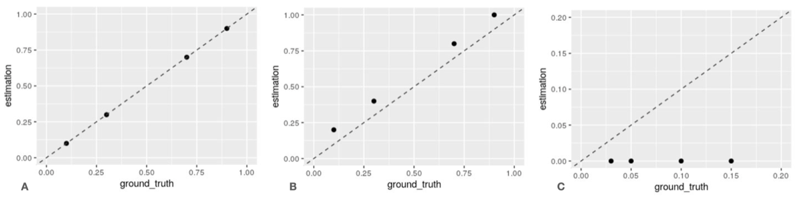

# Results

Tumour deconvolution was performed using different methods and with the CRC atlas of scRNAseq as a reference. The different methods were compared using correlation and RMSE as metrics, to find the best or best set of methods that could best characterise CRC bulk RNAseq samples. For this, the best parameters to use in each method were first found, followed by comparison of methods using only their best parameters.

**Parameter optimization and RNA content bias**

Using the best parameters found through the training set, the RMSE values for the train and test sets were compared for each method (figure 1). This allowed to assess if the best parameters were so fitted for the train samples that the prediction would worsen a lot in the test samples (overfitting).

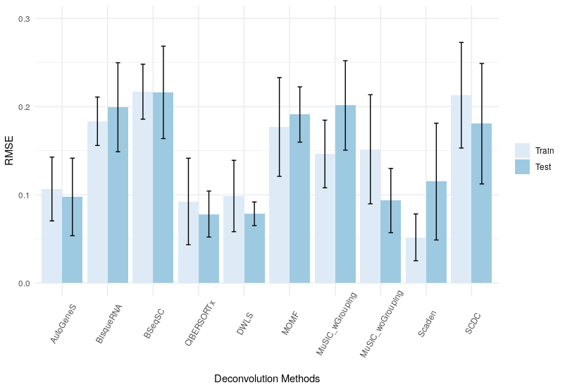{width="100%"}

Overall, overfitting did not happen. In fact, the RMSE even decreased in some methods from the train to the test set. This was more evident in methods like *MuSiC_woGrouping* and *SCDC*. Only for two of the methods we could see some overfitting: *Scaden* and *MuSiC_wGrouping*.

Before going into the prediction results for the test samples, we first explored how much the different parameters' values can affect the methods ability at correctly predicting proportions. For this, we analysed the distribution of the RMSEs through the different sets of parameter combinations, separated by the different values of a parameter. This is present in the next tabset panel.

##  {.tabset}

### AutoGeneS

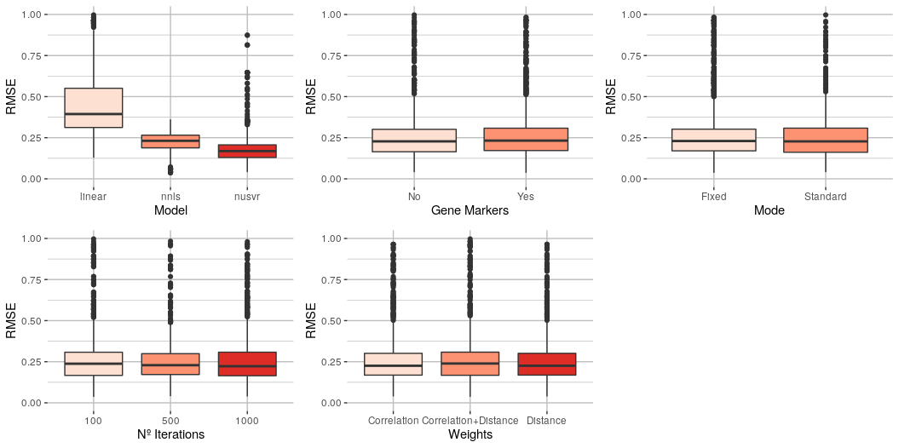

### BisqueRNA

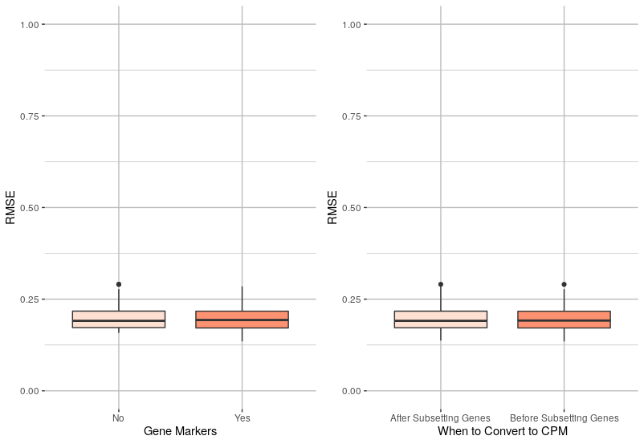

### BSeqSC

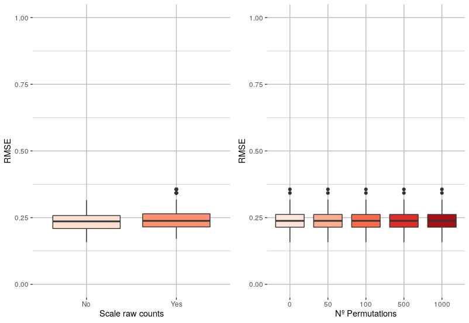

### CIBERSORTx

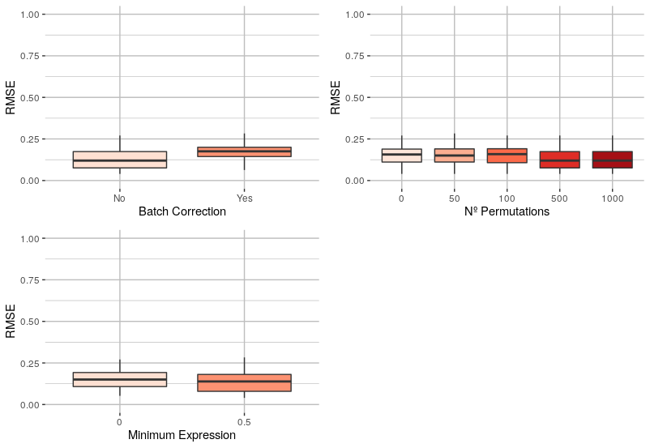

### DWLS

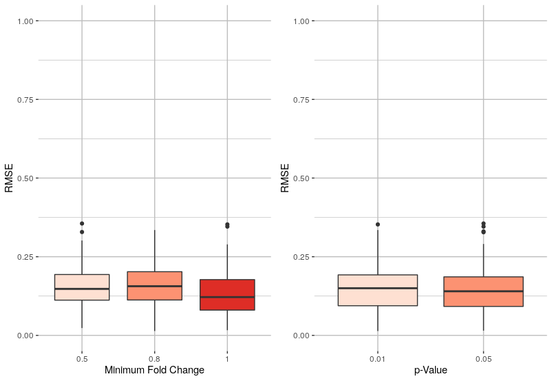

### MOMF

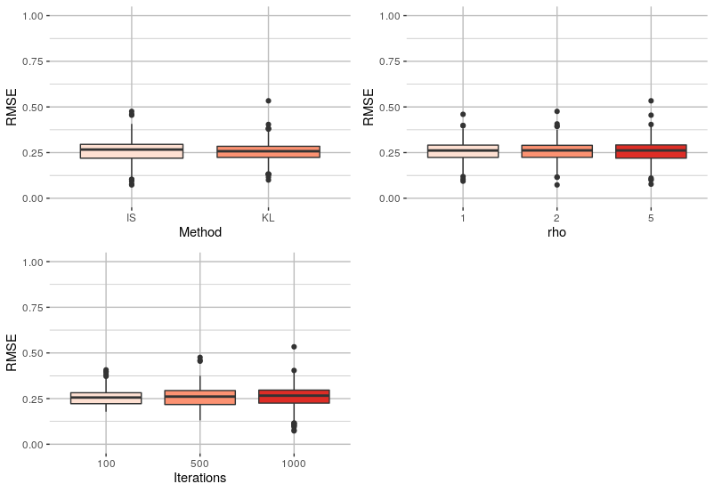

### MuSiC_wGrouping

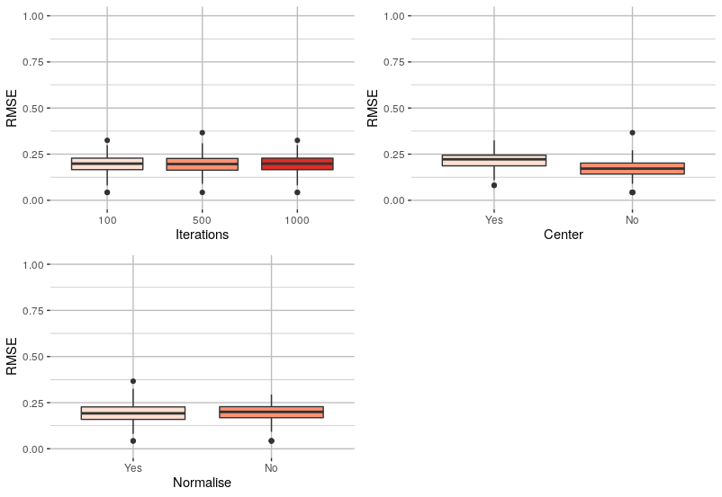

### MuSiC_woGrouping

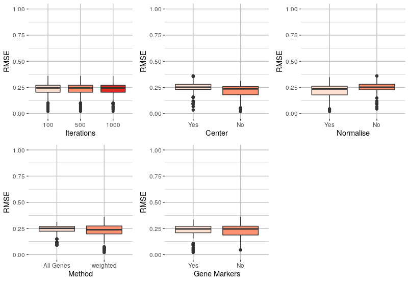

### Scaden

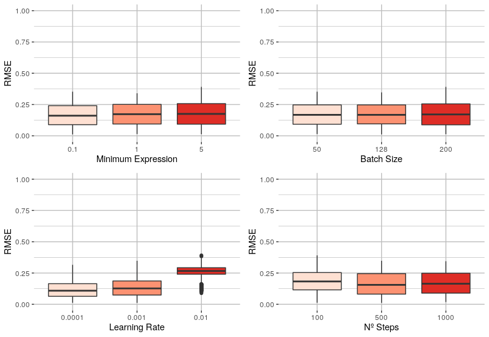

### SCDC

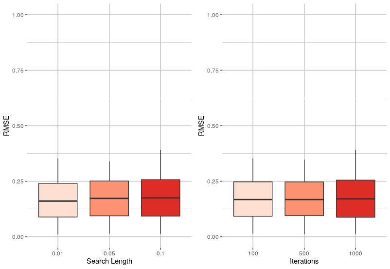

##  

*AutoGeneS* and *Scaden* were the only two methods that seem to have a parameter that affected greatly its outcome. For *AutoGeneS*, this was the *Model* parameter, with 'linear' model returning higher RMSEs than the other two models. *Scaden* showed higher RMSEs for a learning rate of 0.01, when compared to all the other *learning rates* tested. For other methods, the different values for the same parameter appeared to not affect much the final method's outcome.

Regarding RNA content bias correction, only methods *BisqueRNA*, *MOMF* and *Scaden* were better when a correction was applied (table 3). *AutoGeneS* and *MuSiC_woGrouping* already apply a form of correction, and thus were not tested for correction type. Unexpectedly, the remaining methods gave better results when no correction was applied.

|                     | Uncorrected | Corrected Before | Corrected After |
|--------------------:|:-----------:|:----------------:|:---------------:|
|       **BisqueRNA** |             |        ✓         |                 |
|          **BSeqSC** |      ✓      |                  |                 |
|      **CIBERSORTx** |      ✓      |                  |                 |
| **DigitalDLSorter** |     NA      |        NA        |       NA        |
|            **DWLS** |      ✓      |                  |                 |
|            **MOMF** |             |        ✓         |                 |
| **MuSiC_wGrouping** |      ✓      |                  |                 |
|          **Scaden** |             |                  |        ✓        |
|            **SCDC** |      ✓      |                  |                 |

: Table 3: Best correction type for each method. DigitalDLSorter has NA because results regarding this method were not yet obtained.

After looking deeper into how each method was implemented, we did not find any way of calculating the signature matrix and/or the proportions that could reduce the effect of RNA content bias correction in the estimation of cell-type proportions. Also, the bigger cell-types (cancer and stromal cell) were not overestimated by any method with no type of correction for RNA content bias (figures shown in the section '*Best methods for each cell-type*'). In fact, some of the methods that perform RNA content bias correction end up overestimating stromal cells in most samples (figure shown in the section '*Best methods for each cell-type*'), namely *AutoGeneS*, *MuSiC_woGrouping* and *Scaden*, which would be expected of methods without a correction.

Furthermore, the smaller cell-types were mostly under-estimated. However, as this cell-types are also present in very low proportions (\<0.1), this might be due to the methods having more difficulty predicting cell-types with very low proportions.

Finally, when looking into the distribution of the RMSEs through the different sets of parameter combinations, separated by the different types of correction (*figure 3*), the RMSEs varied more when compared to other parameters (previous tabset panel). However, most methods still showed very little variation of RMSEs between the correction types.

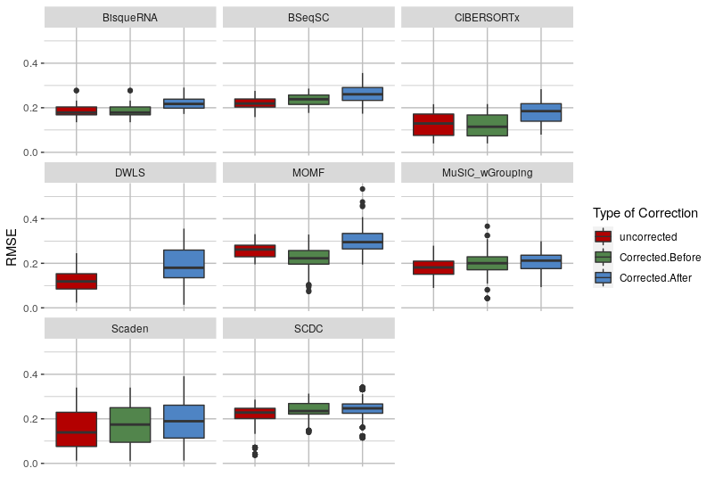

**Best methods overall**

When looking into the overall RMSE and correlation from the test set (figure 5), where methods were run using the best set of parameters found through the train set, we can easily see that five methods performed better than the rest. These methods are, in alphabetical order, *AutoGeneS*, *CIBERSORTx*, *DWLS*, *MuSiC_woGrouping*, and *Scaden*. From these methods, *AutoGeneS* and *MuSiC_woGrouping* natively implement RNA content bias correction, while Scaden's best parameters included correction after the estimation of proportions. *CIBERSORTx*'s and *DWLS*'s best parameters were without any sort of correction.

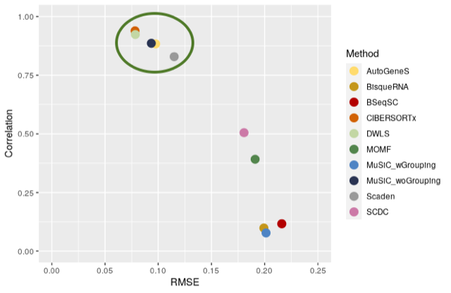

**Best methods for each cell-type**

We next assessed how methods predicted each cell-type individually (figure 5), to understand which methods were the best at predicting each specific cell-type. Moreover, we imagined that just because a method is, overall, one of the best, does not mean that it is the best at predicting every single cell-type. In fact, a good estimation regarding some of the cells might mask those others that are very poorly estimated.


Cancer cells is the cell-type that shows the highest RMSEs overall (even if lower than 0.65), while those cell-types present in smaller proportions in the samples tend to have better RMSEs. The same is not verified for the correlation, where no specific pattern seems to occur.

The best methods for cancer cells are DWLS, MuSiC_woGrouping, Scaden, and AutoGeneS. Even though CIBERSORTx shows negative correlation, the graphic of estimated vs ground truth proportions (next tabset panel) reveals that the method can also be considered as one of the best at predicting cancer cells' proportions. While none of the best methods for stromal cells (MuSiC_wGrouping, BisqueRNA and BSeqSC) were the best overall, only one best method overall (AutoGeneS) was part of the three best methods to predict the proportions of non-specific cells ('other cells' cell-type).

Regarding myeloid cells, both versions of MuSiC were two of the best at predicting anti- and pro-inflammatory cells in the monocytic and macrophage lineage. While BSeqSC, CIBERSORTx, Scaden and SCDC were also good for predicting anti-inflammatory macro/mono proportions, DWLS and BisqueRNA also predicted well the proportions of pro-inflammatory macro/mono cells.

CIBERSORTx and MuSiC_woGrouping were the best methods at predicting Bcells. Even though DWLS showed the highest correlation (figure 5), comparing the estimated and ground-truth proportions (next tabset panel) showed that the prediction is poor when compared to the other two methods.

Regarding T cells, AutoGeneS was good at predicting CD4, regulatory CD4 and CD8 T-cells, while DWLS was good for regulatory CD4, CD8, and proliferative T-cells. CD4 T-cells and regulatory CD4 T-cells also obtained good results from CIBERSORTx and MuSiC_woGrouping, respectively. For proliferative T-cells, besides DWLS, MuSiC_wGrouping and Scaden were also good (figure 5 and next tabset panel).

NK cells was the worst predicted cell-type overall. Scaden was the only method without a negative correlation, although DWLS and BSeqSC had similar RMSE values. Four methods had no correlation (AutoGeneS, CIBERSORTx, MuSiC_woGrouping, and SCDC), meaning that they were not capable of predicting the presence (predicted proportion greater than 0) of this cell-type in any sample. Three of these are part of the best methods overall.

##  {.tabset}

### Cancer cells

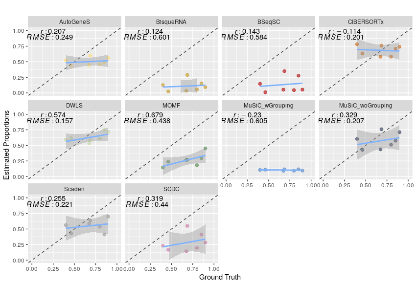

### Stromal cells

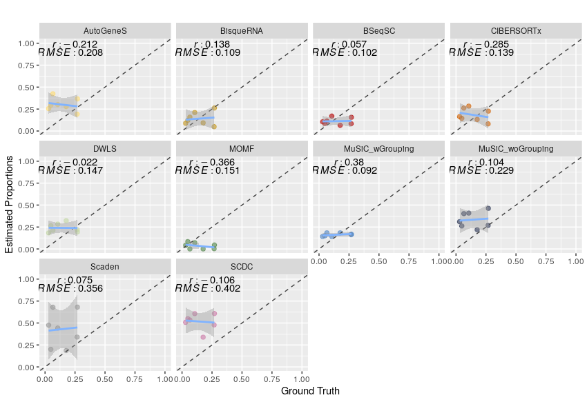

### Anti-Inflammatory macro/mono

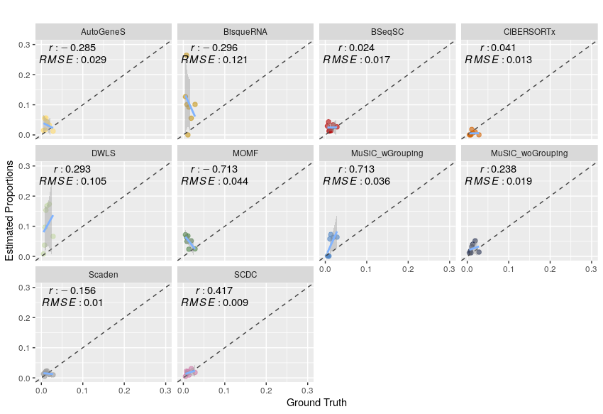

### Pro-Inflammatory macro/mono

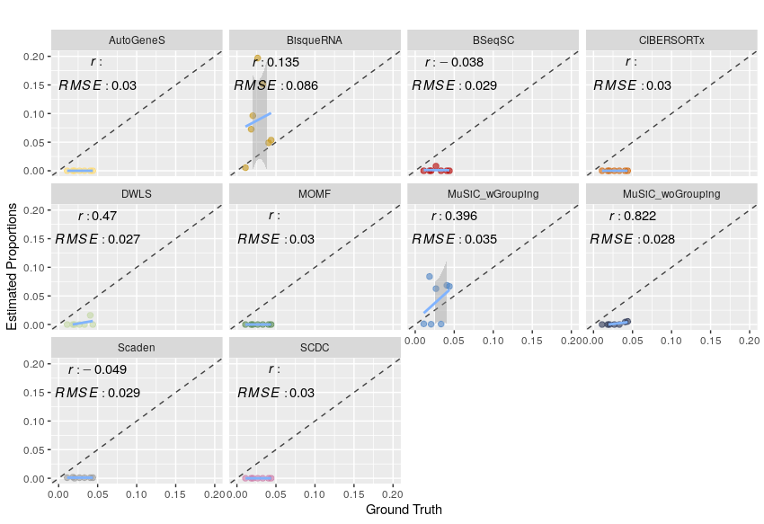

### B-cells

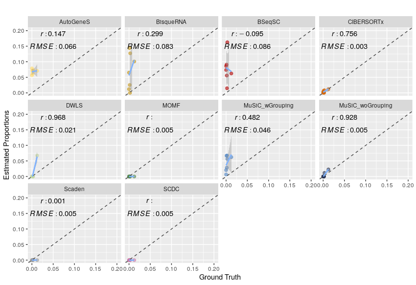

### CD4 T-cells

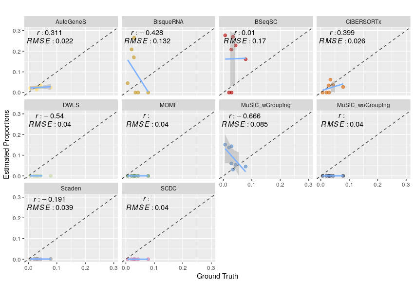

### Regulatory CD4 T-cells

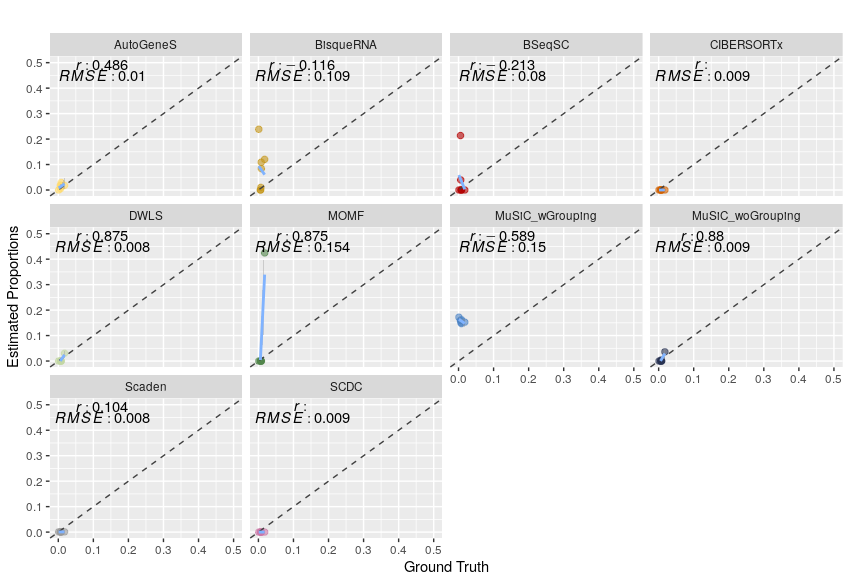

### CD8 T-cells

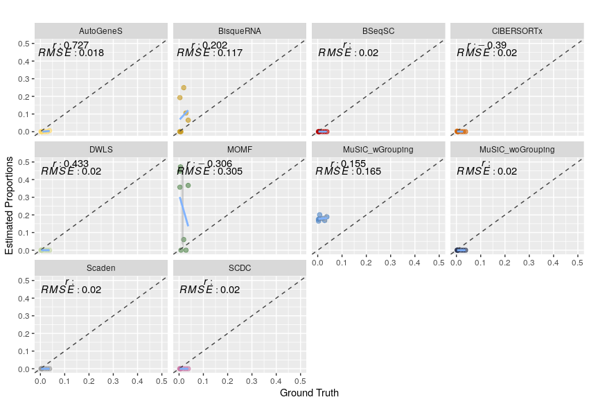

### Proliferative T-cells

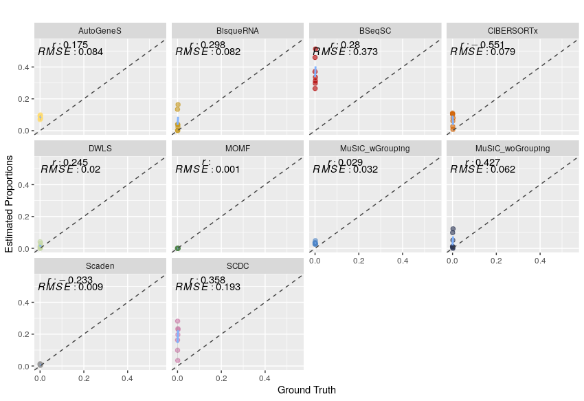

### NK cells


### Other cells

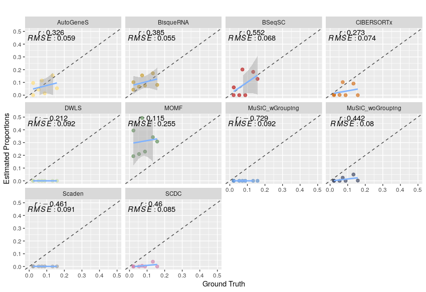

## 

With these results, we can see that the best methods overall are not the best at predicting all cell-types individually (table 4). In fact, for a few cell-types, and especially evident in NK cells, they are not capable to even predict the presence of those cell-types in at least one sample.

|                              | AutoGeneS | BisqueRNA | BSeqSC | CIBERSORTx | DWLS | MOMF | MuSiC_wGrouping | MuSiC_woGrouping | Scaden | SCDC |
|------------------------------|:---------:|:---------:|:------:|:----------:|:----:|:----:|:---------------:|:----------------:|:------:|:----:|
| Overall                      |     ✓     |           |        |     ✓      |  ✓   |      |                 |        ✓         |   ✓    |      |
| Cancer cells                 |     ✓     |           |        |     ✓      |  ✓   |      |                 |        ✓         |   ✓    |      |
| Stromal cells                |           |     ✓     |   ✓    |            |      |      |        ✓        |                  |        |      |
| Anti-Inflammatory macro/mono |           |           |   ✓    |     ✓      |      |      |        ✓        |        ✓         |   ✓    |  ✓   |
| Pro-Inflammatory macro/mono  |           |     ✓     |        |            |  ✓   |      |        ✓        |        ✓         |        |      |
| B-cells                      |           |           |        |     ✓      |      |      |                 |        ✓         |        |      |
| CD4 T-cells                  |     ✓     |           |        |     ✓      |      |      |                 |                  |        |      |
| Regulatory CD4 T-cells       |     ✓     |           |        |            |  ✓   |      |                 |        ✓         |        |      |
| CD8 T-cells                  |     ✓     |           |        |            |  ✓   |      |                 |                  |        |      |
| Proliferative T-cells        |           |           |        |            |  ✓   |      |        ✓        |                  |   ✓    |      |
| NK cells                     |           |           |   ✓    |            |  ✓   |      |                 |                  |   ✓    |      |
| Other cells                  |     ✓     |     ✓     |   ✓    |            |      |      |                 |                  |        |      |

: Table 4: Best methods at predicting the proportions of each cell-type.

# References
